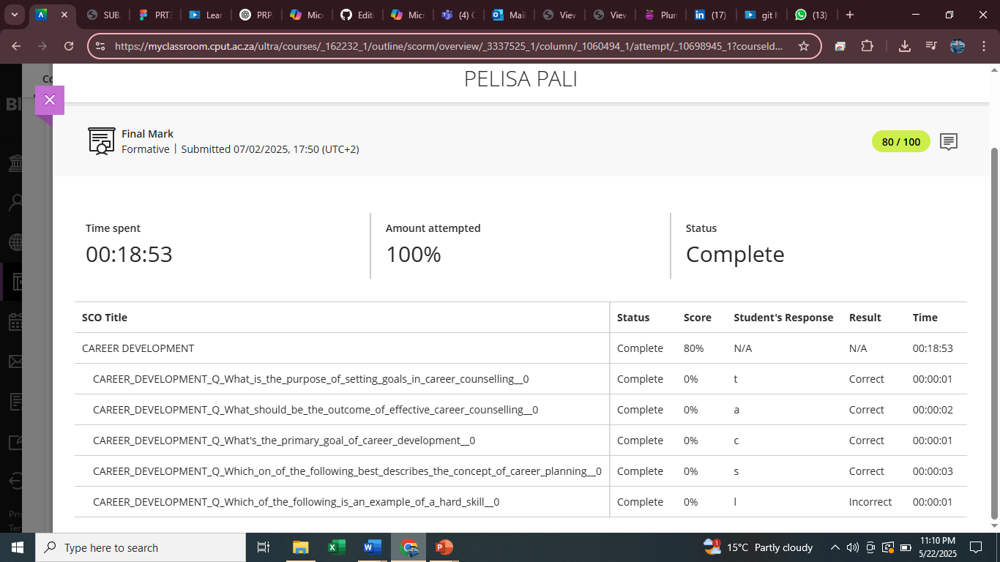
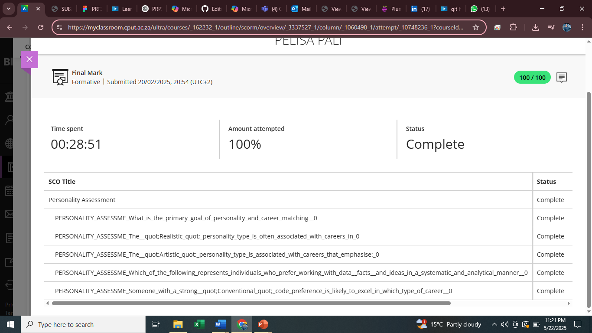
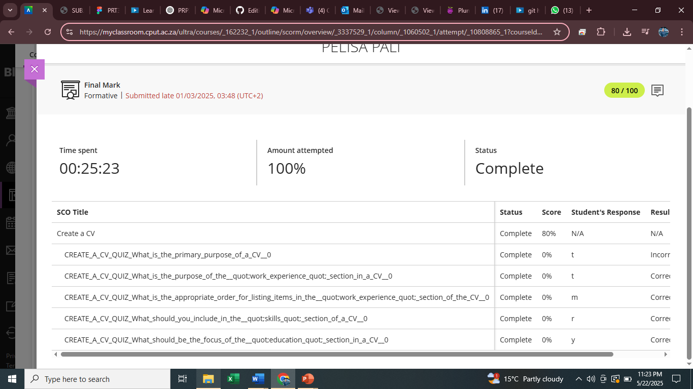

# 🎓 PRP370S Digital Portfolio – Pelisa Pali

**Qualification:** Diploma in ICT – Application Development  
**Institution:** Cape Peninsula University of Technology (CPUT)  
**Year:** 3rd Year (2025)  
**Student Number:** 217189113  

---

##  Career Counselling

###  Evidence
- Completed the Career Development module and scored 80%.
- Learned about goal-setting, career planning, and distinguishing soft vs. hard skills.

###  Reflection (STAR)
**S:** I completed a quiz that tested my understanding of career planning and counselling.  
**T:** I needed to understand how to set goals, the value of career development, and identify hard vs. soft skills.  
**A:** I read through the career material and completed the assessment.  
**R:** I scored 80% and gained a clear understanding of how to plan my career path and the importance of structured career goals.

---

##  Skills and Interests

### Evidence
- Completed the **Skills and Interests** module with a score of 100%.
- Learned about different types of skills: technical, soft, and transferable.
- Gained insights into how **values** and **interests** influence career choices.

###  Reflection (STAR)
**S:** I completed a quiz about the difference between skills, interests, and values in the workplace.  
**T:** I needed to understand how my skills and personal values align with career paths.  
**A:** I learned that skills can be technical or transferable (like problem-solving or communication), and that interests are activities I enjoy doing, which influence job satisfaction. I also learned how values like honesty, creativity, and achievement guide my career decisions.  
**R:** I now better understand how to match my skills and interests with the right roles, and I feel more confident identifying career paths that align with my personal values.

---

## Personality Assessment

###  Evidence
- Completed the Personality Assessment quiz with a score of 100%.
- Learned about career alignment for personality types (e.g., Realistic, Artistic, Conventional).

###  Reflection (STAR)
**S:** I completed an online personality quiz that linked traits to career types.  
**T:** I had to assess how my personality fits different roles.  
**A:** I discovered that I’m analytical, responsible, and helpful — but not confident in public speaking.  
**R:** I now understand how my strengths (eagerness to learn, explaining things clearly) and weaknesses (public speaking) can guide my job choices and development.

---

##  CV Creation

###  Evidence
- Completed the "Create a CV" module with a score of 80%.
- Learned about structuring work experience, listing skills, and writing clear job objectives.

###  Reflection (STAR)
**S:** I took a CV creation quiz and studied the structure of professional CVs.  
**T:** My task was to create a CV highlighting my education, experience, and skills.  
**A:** I wrote a clean, structured CV with accurate job experience, technical and soft skills.  
**R:** I scored 80% in the quiz and finalized a CV I can confidently send to employers.

---

##  CV Submission

###  Evidence
- Successfully submitted my final CV to Blackboard as part of the work readiness task.

### ✍️ Reflection (STAR)
**S:** Part of the assessment required us to upload our CV.  
**T:** I had to ensure that my CV was up-to-date and submission-ready.  
**A:** I revised my layout, double-checked my spelling and formatting, and uploaded it before the deadline.  
**R:** My CV was submitted successfully, marking a key step in preparing for the job market.

---

##  Project Experience

### 📌 E-commerce Clothing Website
- **Role:** Group Leader  
- **Contribution:** Designed the homepage and implemented shopping cart functionality using HTML, CSS, and JavaScript.

### 📌 Recycling Center Web Page
- **Role:** Developer  
- **Contribution:** Created the interactive map page and developed the admin dashboard using PHP and SQL.

---

##  Contact Me

-  [LinkedIn](https://linkedin.com/in/your-profile)
-  Email: 217189113@mycput.ac.za  

---

> _“I am passionate about building digital solutions that make life easier. I'm ready to apply my skills in a real-world environment and grow as a software developer.”_
